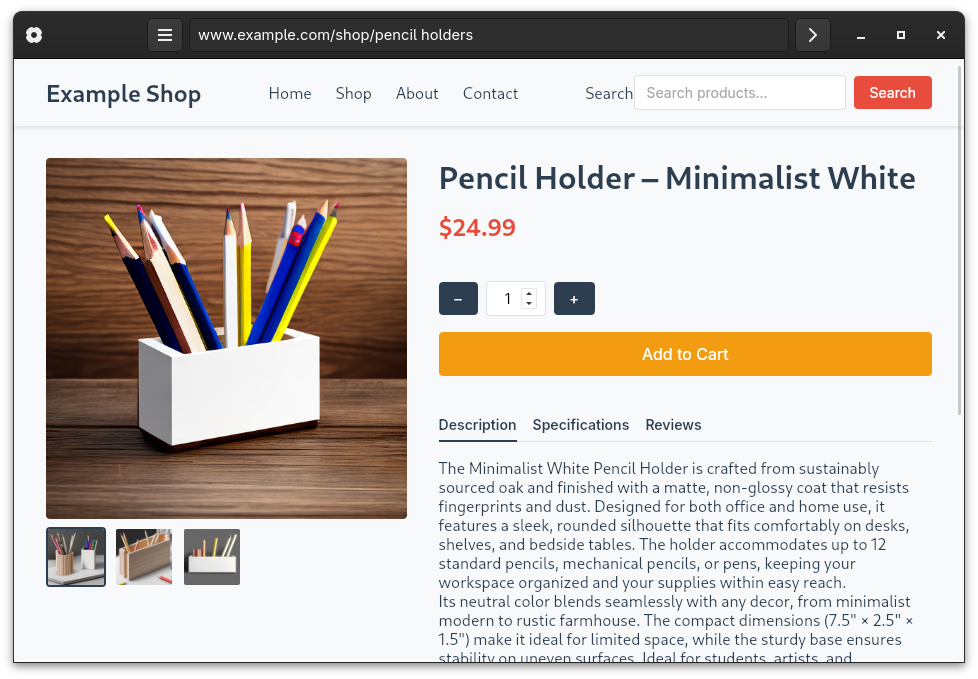
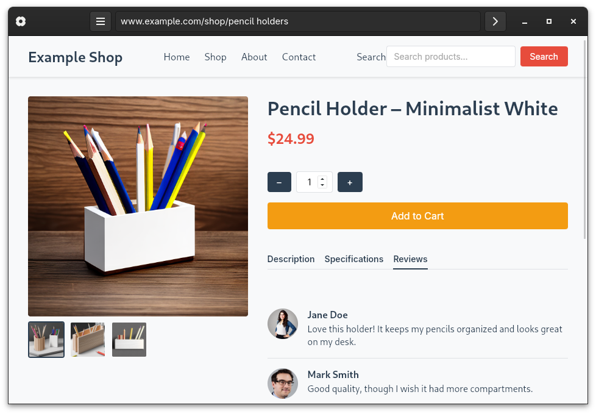
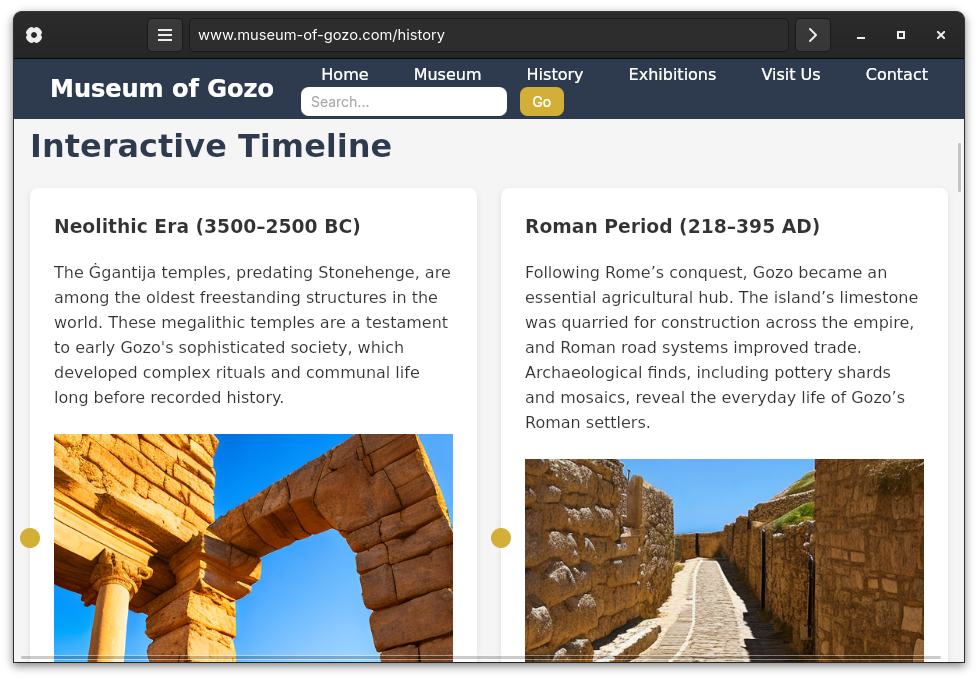
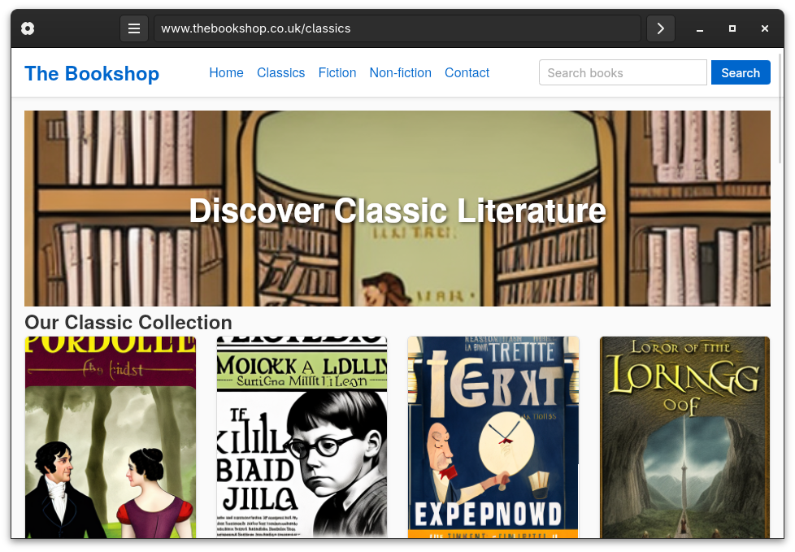
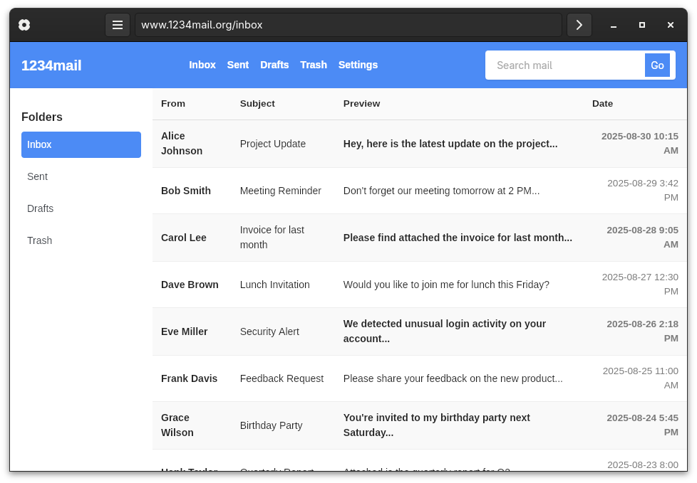
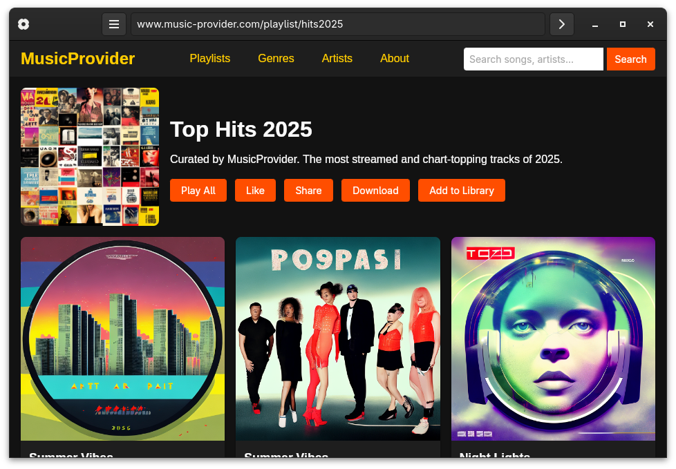
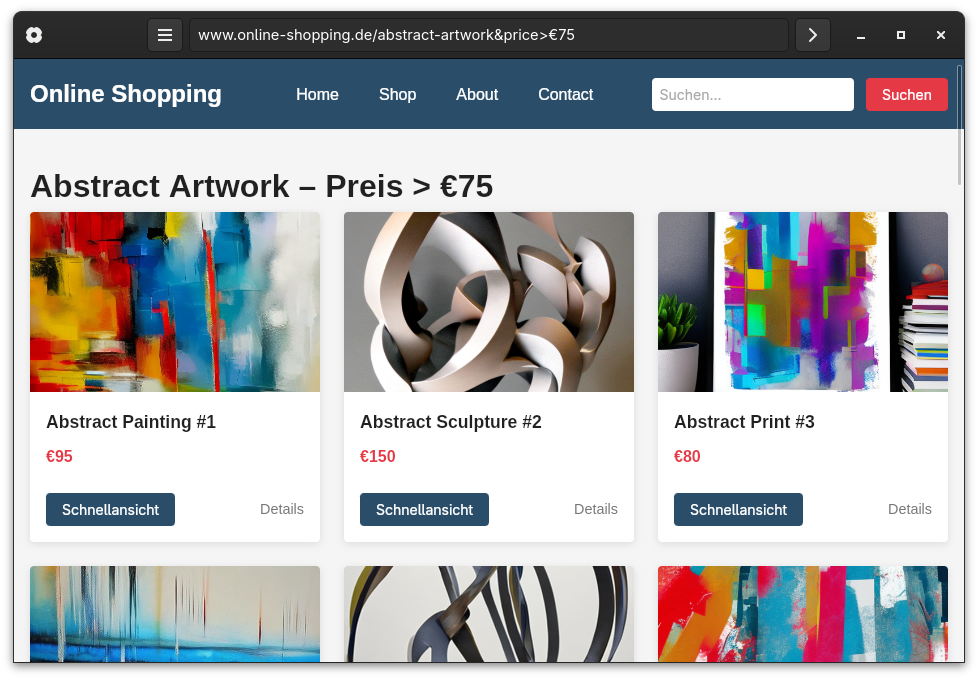
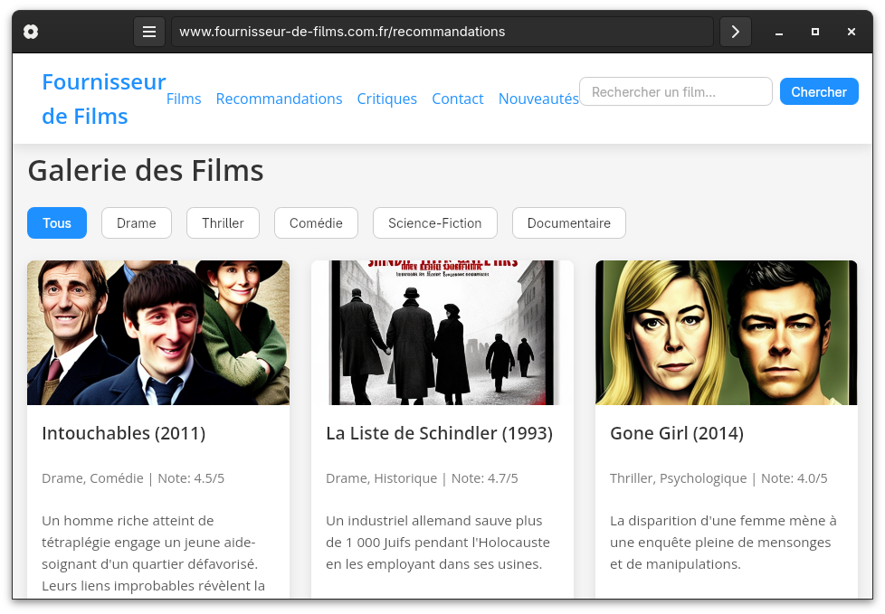
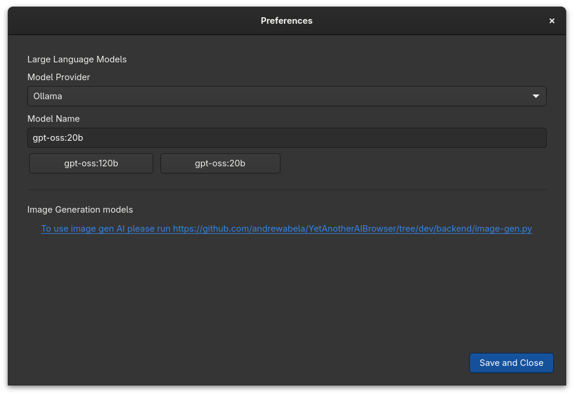
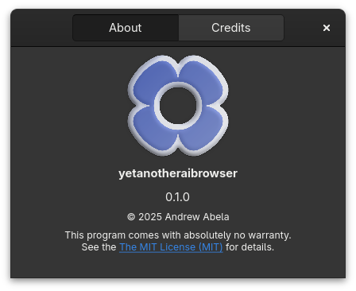

# Yet Another AI Browser

*Yet Another AI Browser* is a web browser that replaces fetching HTML content from websites with AI-generated content.

## Screenshots

    
    
    
    
    
    
    
    
    
    

## Installation
Pre-built binaries are available for Linux as Flatpaks and can be found in the [releases](https://github.com/andrewabela/YetAnotherAIBrowser/releases) section.

## Contributing
### Building from Source
See [docs.gtk.org/gtk4/building.html](https://docs.gtk.org/gtk4/building.html) for instructions on building GTK applications.
### Recommended IDE
I recommend using [Gnome Builder](https://www.gtk.org/docs/dev-tools/gnome-builder/) as it has built-in support for building and running Flatpak applications.